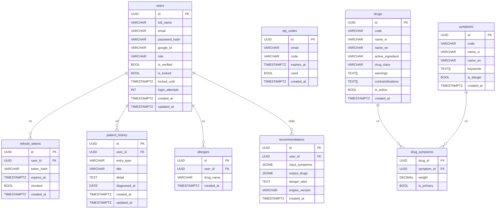

# Tài liệu Thiết kế Cơ sở Dữ liệu — MedAssist AI

**Dự án:** MedAssist AI — Hệ thống Gợi ý Thuốc theo Cụm Triệu chứng và Tiền sử Bệnh  
**Phiên bản tài liệu:** 1.0.0  
**Ngày tạo:** 20/05/2026  
**Người phụ trách:** Tín (Database · DevOps)  
**Leader duyệt:** HA  
**Mục tiêu nộp:** Sprint 1 — ERD approved trước 18/5/2026

---

## Mục lục

1. [Tổng quan Thiết kế CSDL](#1-tổng-quan-thiết-kế-csdl)
2. [Sơ đồ ERD](#2-sơ-đồ-erd)
3. [Mô tả Chi tiết Từng Bảng](#3-mô-tả-chi-tiết-từng-bảng)
4. [Quan hệ Giữa Các Bảng](#4-quan-hệ-giữa-các-bảng)
5. [Thiết kế Index](#5-thiết-kế-index)
6. [Thiết kế Cột JSONB](#6-thiết-kế-cột-jsonb)
7. [Chính sách Lưu trữ Dữ liệu](#7-chính-sách-lưu-trữ-dữ-liệu)
8. [Bảo mật Dữ liệu](#8-bảo-mật-dữ-liệu)
9. [Chiến lược Migration](#9-chiến-lược-migration)

---

## 1. Tổng quan Thiết kế CSDL

### 1.1 Lý do chọn PostgreSQL trên Supabase

Hệ thống MedAssist AI lựa chọn **PostgreSQL** làm hệ quản trị cơ sở dữ liệu quan hệ chính vì các lý do sau:

| Tiêu chí | PostgreSQL | Lý do phù hợp với MedAssist AI |
|---|---|---|
| **Kiểu dữ liệu phong phú** | Hỗ trợ `JSONB`, `TEXT[]`, `UUID`, `TIMESTAMPTZ` | Lưu trữ kết quả AI dạng JSON linh hoạt; mảng từ khóa cho triệu chứng |
| **Toàn vẹn dữ liệu** | `FOREIGN KEY`, `CHECK`, `UNIQUE` constraint đầy đủ | Dữ liệu y tế yêu cầu tính nhất quán tuyệt đối |
| **Hiệu năng JSONB** | Index GIN trên cột JSONB | Truy vấn lịch sử gợi ý theo nội dung JSON nhanh |
| **Mã nguồn mở** | Không phí license | Phù hợp dự án học thuật/startup |
| **Hỗ trợ ACID** | Transaction đầy đủ | Đảm bảo nhất quán khi ghi đồng thời nhiều luồng |

**Supabase** được chọn làm nền tảng hosting PostgreSQL vì:
- Tier miễn phí đủ cho môi trường development và staging của nhóm 5 người
- Cung cấp REST API tự động (PostgREST) và Dashboard quản trị trực quan
- Tích hợp sẵn Row-Level Security (RLS) cho tầng bảo mật bổ sung
- Hỗ trợ realtime subscription — tiềm năng mở rộng trong các phiên bản sau

### 1.2 Chiến lược khóa chính — UUID v4

Toàn bộ 9 bảng sử dụng **UUID v4** làm khóa chính thay vì `BIGSERIAL` (auto-increment). Lý do:

- **Phân tán an toàn:** UUID không lộ thứ tự bản ghi, hạn chế kẻ tấn công đoán ID liên tiếp (`IDOR attack`)
- **Merge dữ liệu:** Khi nhập dữ liệu từ nhiều nguồn (seed data, backup restore), UUID tránh xung đột khóa
- **Không phụ thuộc DB:** Client có thể sinh UUID trước khi ghi xuống DB, hỗ trợ optimistic insert
- **Chuẩn REST:** UUID làm URL parameter (`/users/:id`) trực quan và không tiết lộ thông tin hệ thống

Hàm sinh UUID trong PostgreSQL: `gen_random_uuid()` (extension `pgcrypto`, sẵn có trên Supabase).

### 1.3 Chuẩn hóa dữ liệu — 3NF (Third Normal Form)

Thiết kế tuân theo **Dạng chuẩn thứ ba (3NF)**:

- **1NF:** Mỗi ô chỉ chứa một giá trị nguyên tử. Ngoại lệ có kiểm soát: `keywords TEXT[]` và `warnings TEXT[]` dùng kiểu mảng PostgreSQL native — được chấp nhận vì đây là danh sách thuần nhất không cần truy vấn join.
- **2NF:** Mọi cột non-key phụ thuộc hoàn toàn vào khóa chính. Bảng `drug_symptoms` (khóa tổ hợp) không có cột nào phụ thuộc một phần.
- **3NF:** Không có phụ thuộc bắc cầu. Thông tin thuốc nằm trong `drugs`, thông tin triệu chứng nằm trong `symptoms` — bảng `drug_symptoms` chỉ lưu quan hệ và trọng số.

**Quyết định phi chuẩn có chủ ý:**
- `recommendations.input_symptoms` và `recommendations.output_drugs` là JSONB — chấp nhận denormalization vì đây là **snapshot không thay đổi** của một phiên gợi ý, không cần truy vấn join phức tạp.

### 1.4 Chiến lược timestamp

- Tất cả timestamp dùng kiểu `TIMESTAMPTZ` (timestamp with time zone) — lưu theo UTC, tránh lỗi timezone khi deploy trên nhiều vùng địa lý
- Các bảng có vòng đời dữ liệu đều có cặp `created_at` / `updated_at` tự cập nhật qua trigger PostgreSQL

---

## 2. Sơ đồ ERD

Sơ đồ dưới đây thể hiện toàn bộ 9 bảng, các cột chính, và mối quan hệ khóa ngoại giữa chúng.



> **Ghi chú:** Bảng `otp_codes` không có khóa ngoại tới `users` — thiết kế có chủ ý vì OTP được gửi tới email trước khi tài khoản được xác minh, nên không thể ràng buộc FK.

---

## 3. Mô tả Chi tiết Từng Bảng

---

### 3.1 Bảng `users`

**Mục đích:** Lưu trữ thông tin tài khoản người dùng và quản trị viên. Là trung tâm của hệ thống — mọi dữ liệu cá nhân hóa đều liên kết về bảng này.

**DDL:**

```sql
CREATE TABLE users (
    id              UUID          PRIMARY KEY DEFAULT gen_random_uuid(),
    full_name       VARCHAR(100)  NOT NULL,
    email           VARCHAR(255)  NOT NULL UNIQUE,
    password_hash   VARCHAR(255),
    google_id       VARCHAR(255)  UNIQUE,
    role            VARCHAR(20)   NOT NULL DEFAULT 'user'
                                  CHECK (role IN ('user', 'admin')),
    is_verified     BOOLEAN       NOT NULL DEFAULT false,
    is_locked       BOOLEAN       NOT NULL DEFAULT false,
    locked_until    TIMESTAMPTZ,
    login_attempts  INTEGER       NOT NULL DEFAULT 0,
    created_at      TIMESTAMPTZ   NOT NULL DEFAULT now(),
    updated_at      TIMESTAMPTZ   NOT NULL DEFAULT now()
);
```

**Mô tả các cột:**

| Cột | Kiểu dữ liệu | Ràng buộc | Mô tả |
|---|---|---|---|
| `id` | UUID | PK, DEFAULT gen_random_uuid() | Định danh duy nhất, tự sinh |
| `full_name` | VARCHAR(100) | NOT NULL | Họ tên đầy đủ hiển thị trên UI |
| `email` | VARCHAR(255) | NOT NULL, UNIQUE | Email đăng nhập, dùng để gửi OTP |
| `password_hash` | VARCHAR(255) | nullable | Mật khẩu đã hash bằng bcrypt (NULL nếu đăng nhập Google) |
| `google_id` | VARCHAR(255) | UNIQUE, nullable | Sub ID từ Google OAuth2. NULL nếu đăng nhập thường |
| `role` | VARCHAR(20) | CHECK IN ('user','admin'), DEFAULT 'user' | Phân quyền. Admin có thể quản lý danh mục thuốc/triệu chứng |
| `is_verified` | BOOLEAN | DEFAULT false | Tài khoản đã xác minh email chưa |
| `is_locked` | BOOLEAN | DEFAULT false | Tài khoản bị khóa do đăng nhập sai nhiều lần |
| `locked_until` | TIMESTAMPTZ | nullable | Thời điểm tự động mở khóa. NULL nếu không bị khóa |
| `login_attempts` | INTEGER | DEFAULT 0 | Số lần đăng nhập sai liên tiếp. Reset về 0 khi đăng nhập thành công |
| `created_at` | TIMESTAMPTZ | DEFAULT now() | Thời điểm tạo tài khoản |
| `updated_at` | TIMESTAMPTZ | DEFAULT now() | Thời điểm cập nhật gần nhất (trigger tự cập nhật) |

**Dữ liệu mẫu:**

```
id: a1b2c3d4-e5f6-7890-abcd-ef1234567890
full_name: Nguyễn Văn An
email: nguyen.an@gmail.com
password_hash: $2b$12$hashed...
google_id: NULL
role: user
is_verified: true
is_locked: false
locked_until: NULL
login_attempts: 0
```

---

### 3.2 Bảng `refresh_tokens`

**Mục đích:** Lưu trữ Refresh Token của JWT. Backend Node.js dùng bảng này để xác thực và thu hồi token, thực hiện cơ chế Refresh Token Rotation.

**DDL:**

```sql
CREATE TABLE refresh_tokens (
    id          UUID          PRIMARY KEY DEFAULT gen_random_uuid(),
    user_id     UUID          NOT NULL REFERENCES users(id) ON DELETE CASCADE,
    token_hash  VARCHAR(255)  NOT NULL UNIQUE,
    expires_at  TIMESTAMPTZ   NOT NULL,
    revoked     BOOLEAN       NOT NULL DEFAULT false,
    created_at  TIMESTAMPTZ   NOT NULL DEFAULT now()
);
```

**Mô tả các cột:**

| Cột | Kiểu dữ liệu | Ràng buộc | Mô tả |
|---|---|---|---|
| `id` | UUID | PK | Định danh bản ghi |
| `user_id` | UUID | FK → users(id) CASCADE | Chủ sở hữu token. Xóa user → xóa toàn bộ token |
| `token_hash` | VARCHAR(255) | UNIQUE | Token đã được hash SHA-256 — không bao giờ lưu token plaintext |
| `expires_at` | TIMESTAMPTZ | NOT NULL | Thời điểm token hết hạn (thường 7–30 ngày) |
| `revoked` | BOOLEAN | DEFAULT false | Token đã bị thu hồi chủ động (logout) chưa |
| `created_at` | TIMESTAMPTZ | DEFAULT now() | Thời điểm phát hành token |

**Dữ liệu mẫu:**

```
id: b2c3d4e5-f6a7-8901-bcde-f12345678901
user_id: a1b2c3d4-e5f6-7890-abcd-ef1234567890
token_hash: sha256:9f86d081884c7d659...
expires_at: 2026-06-20T00:00:00Z
revoked: false
```

---

### 3.3 Bảng `otp_codes`

**Mục đích:** Lưu mã OTP một lần (6 chữ số) gửi qua email để xác minh tài khoản hoặc đặt lại mật khẩu.

**DDL:**

```sql
CREATE TABLE otp_codes (
    id          UUID         PRIMARY KEY DEFAULT gen_random_uuid(),
    email       VARCHAR(255) NOT NULL,
    code        VARCHAR(6)   NOT NULL,
    expires_at  TIMESTAMPTZ  NOT NULL,
    used        BOOLEAN      NOT NULL DEFAULT false,
    created_at  TIMESTAMPTZ  NOT NULL DEFAULT now()
);
```

**Mô tả các cột:**

| Cột | Kiểu dữ liệu | Ràng buộc | Mô tả |
|---|---|---|---|
| `id` | UUID | PK | Định danh bản ghi |
| `email` | VARCHAR(255) | NOT NULL | Email nhận OTP (không FK vì user chưa tồn tại khi đăng ký) |
| `code` | VARCHAR(6) | NOT NULL | Mã 6 chữ số. Nên hash thêm trước khi lưu trong production |
| `expires_at` | TIMESTAMPTZ | NOT NULL | Thời điểm hết hạn (thường 10–15 phút sau khi tạo) |
| `used` | BOOLEAN | DEFAULT false | Đã sử dụng hay chưa. OTP đã dùng không được dùng lại |
| `created_at` | TIMESTAMPTZ | DEFAULT now() | Thời điểm tạo OTP |

**Dữ liệu mẫu:**

```
id: c3d4e5f6-a7b8-9012-cdef-123456789012
email: nguyen.an@gmail.com
code: 482910
expires_at: 2026-05-20T10:15:00Z
used: false
```

---

### 3.4 Bảng `symptoms`

**Mục đích:** Danh mục chuẩn các triệu chứng bệnh. AI Engine và Frontend đều tham chiếu bảng này. Là dữ liệu tham chiếu (reference data) — thay đổi ít, đọc nhiều.

**DDL:**

```sql
CREATE TABLE symptoms (
    id          UUID          PRIMARY KEY DEFAULT gen_random_uuid(),
    code        VARCHAR(50)   NOT NULL UNIQUE,
    name_vi     VARCHAR(100)  NOT NULL,
    name_en     VARCHAR(100)  NOT NULL,
    keywords    TEXT[]        NOT NULL DEFAULT '{}',
    is_danger   BOOLEAN       NOT NULL DEFAULT false,
    created_at  TIMESTAMPTZ   NOT NULL DEFAULT now()
);
```

**Mô tả các cột:**

| Cột | Kiểu dữ liệu | Ràng buộc | Mô tả |
|---|---|---|---|
| `id` | UUID | PK | Định danh duy nhất |
| `code` | VARCHAR(50) | UNIQUE | Mã slug không dấu, dùng trong API payload (ví dụ: `sot`, `dau_dau`) |
| `name_vi` | VARCHAR(100) | NOT NULL | Tên triệu chứng bằng tiếng Việt (hiển thị UI) |
| `name_en` | VARCHAR(100) | NOT NULL | Tên tiếng Anh (dùng cho AI Engine Python) |
| `keywords` | TEXT[] | DEFAULT '{}' | Mảng từ khóa đồng nghĩa, hỗ trợ fuzzy search (ví dụ: `{"nóng sốt","sốt cao","38 độ"}`) |
| `is_danger` | BOOLEAN | DEFAULT false | Đánh dấu triệu chứng nguy hiểm — kích hoạt cảnh báo đặc biệt trên UI |
| `created_at` | TIMESTAMPTZ | DEFAULT now() | Thời điểm thêm vào danh mục |

**Dữ liệu mẫu:**

```
id: d4e5f6a7-b8c9-0123-defa-234567890123
code: sot
name_vi: Sốt
name_en: fever
keywords: {nóng sốt, sốt cao, thân nhiệt tăng, 38 độ, 39 độ}
is_danger: false

---

id: e5f6a7b8-c9d0-1234-efab-345678901234
code: kho_tho_nang
name_vi: Khó thở nặng
name_en: severe_dyspnea
keywords: {ngạt thở, thở không được, tức ngực nghiêm trọng}
is_danger: true
```

---

### 3.5 Bảng `drugs`

**Mục đích:** Danh mục thuốc trong hệ thống. Mỗi thuốc có thông tin dược học đầy đủ để AI Engine và Backend lọc, cảnh báo khi gợi ý.

**DDL:**

```sql
CREATE TABLE drugs (
    id                  UUID          PRIMARY KEY DEFAULT gen_random_uuid(),
    code                VARCHAR(50)   NOT NULL UNIQUE,
    name_vi             VARCHAR(200)  NOT NULL,
    name_en             VARCHAR(200),
    active_ingredient   VARCHAR(200)  NOT NULL,
    drug_class          VARCHAR(100),
    warnings            TEXT[]        NOT NULL DEFAULT '{}',
    contraindications   TEXT[]        NOT NULL DEFAULT '{}',
    is_active           BOOLEAN       NOT NULL DEFAULT true,
    created_at          TIMESTAMPTZ   NOT NULL DEFAULT now()
);
```

**Mô tả các cột:**

| Cột | Kiểu dữ liệu | Ràng buộc | Mô tả |
|---|---|---|---|
| `id` | UUID | PK | Định danh duy nhất |
| `code` | VARCHAR(50) | UNIQUE | Mã slug định danh (ví dụ: `paracetamol_500`) |
| `name_vi` | VARCHAR(200) | NOT NULL | Tên thương mại tiếng Việt |
| `name_en` | VARCHAR(200) | nullable | Tên quốc tế INN (International Nonproprietary Name) |
| `active_ingredient` | VARCHAR(200) | NOT NULL | Hoạt chất chính (ví dụ: Paracetamol, Ibuprofen) |
| `drug_class` | VARCHAR(100) | nullable | Nhóm dược lý (ví dụ: NSAID, kháng sinh nhóm Beta-lactam) |
| `warnings` | TEXT[] | DEFAULT '{}' | Mảng cảnh báo sử dụng (ví dụ: {"Không dùng quá 4g/ngày","Tránh rượu bia"}) |
| `contraindications` | TEXT[] | DEFAULT '{}' | Mảng chống chỉ định (ví dụ: {"Suy gan nặng","Dị ứng Paracetamol"}) |
| `is_active` | BOOLEAN | DEFAULT true | Soft delete — `false` nghĩa là thuốc không còn được gợi ý nhưng lịch sử vẫn giữ |
| `created_at` | TIMESTAMPTZ | DEFAULT now() | Thời điểm thêm vào danh mục |

**Dữ liệu mẫu:**

```
id: f6a7b8c9-d0e1-2345-fabc-456789012345
code: paracetamol_500
name_vi: Paracetamol 500mg
name_en: Paracetamol 500mg
active_ingredient: Paracetamol
drug_class: Analgesic/Antipyretic
warnings: {Không dùng quá 4g/ngày, Tránh dùng cùng rượu bia, Thận trọng với người suy gan}
contraindications: {Dị ứng Paracetamol, Suy gan nặng}
is_active: true
```

---

### 3.6 Bảng `drug_symptoms`

**Mục đích:** Bảng trung gian thể hiện quan hệ nhiều-nhiều (N:N) giữa thuốc và triệu chứng. Lưu thêm trọng số (`weight`) phản ánh mức độ hiệu quả của thuốc đối với triệu chứng — đây là dữ liệu nền cho AI Engine rule-based.

**DDL:**

```sql
CREATE TABLE drug_symptoms (
    drug_id     UUID     NOT NULL REFERENCES drugs(id) ON DELETE CASCADE,
    symptom_id  UUID     NOT NULL REFERENCES symptoms(id) ON DELETE CASCADE,
    weight      DECIMAL(3,2) NOT NULL DEFAULT 1.0
                         CHECK (weight >= 0.0 AND weight <= 1.0),
    is_primary  BOOLEAN  NOT NULL DEFAULT false,
    PRIMARY KEY (drug_id, symptom_id)
);
```

**Mô tả các cột:**

| Cột | Kiểu dữ liệu | Ràng buộc | Mô tả |
|---|---|---|---|
| `drug_id` | UUID | PK (phần 1), FK → drugs CASCADE | Thuốc |
| `symptom_id` | UUID | PK (phần 2), FK → symptoms CASCADE | Triệu chứng |
| `weight` | DECIMAL(3,2) | CHECK 0.0–1.0, DEFAULT 1.0 | Trọng số hiệu quả (0.0 = không hiệu quả, 1.0 = rất hiệu quả). AI Engine dùng để tính confidence score |
| `is_primary` | BOOLEAN | DEFAULT false | Triệu chứng này có phải chỉ định chính của thuốc không |

**Dữ liệu mẫu:**

```
drug_id: f6a7b8c9... (Paracetamol 500mg)
symptom_id: d4e5f6a7... (Sốt)
weight: 0.95
is_primary: true

drug_id: f6a7b8c9... (Paracetamol 500mg)
symptom_id: [UUID của đau đầu]
weight: 0.80
is_primary: false
```

---

### 3.7 Bảng `patient_history`

**Mục đích:** Lưu tiền sử bệnh cá nhân hóa của từng người dùng. AI Engine sử dụng dữ liệu này để lọc và điều chỉnh kết quả gợi ý phù hợp với tình trạng sức khỏe hiện tại.

**DDL:**

```sql
CREATE TABLE patient_history (
    id           UUID         PRIMARY KEY DEFAULT gen_random_uuid(),
    user_id      UUID         NOT NULL REFERENCES users(id) ON DELETE CASCADE,
    entry_type   VARCHAR(30)  NOT NULL
                              CHECK (entry_type IN ('chronic_disease', 'current_medication', 'diagnosis')),
    title        VARCHAR(200) NOT NULL,
    detail       TEXT,
    diagnosed_at DATE,
    created_at   TIMESTAMPTZ  NOT NULL DEFAULT now(),
    updated_at   TIMESTAMPTZ  NOT NULL DEFAULT now()
);
```

**Mô tả các cột:**

| Cột | Kiểu dữ liệu | Ràng buộc | Mô tả |
|---|---|---|---|
| `id` | UUID | PK | Định danh duy nhất |
| `user_id` | UUID | FK → users CASCADE | Chủ sở hữu bản ghi tiền sử |
| `entry_type` | VARCHAR(30) | CHECK IN (...) | Loại mục: `chronic_disease` (bệnh mãn tính), `current_medication` (đang dùng thuốc), `diagnosis` (chẩn đoán gần đây) |
| `title` | VARCHAR(200) | NOT NULL | Tiêu đề mục (ví dụ: "Tiểu đường type 2", "Đang uống Metformin") |
| `detail` | TEXT | nullable | Mô tả chi tiết thêm (ghi chú của bác sĩ, liều lượng, v.v.) |
| `diagnosed_at` | DATE | nullable | Ngày được chẩn đoán hoặc bắt đầu dùng thuốc |
| `created_at` | TIMESTAMPTZ | DEFAULT now() | Thời điểm thêm bản ghi |
| `updated_at` | TIMESTAMPTZ | DEFAULT now() | Thời điểm cập nhật gần nhất |

**Dữ liệu mẫu:**

```
id: a7b8c9d0-e1f2-3456-abcd-567890123456
user_id: a1b2c3d4...
entry_type: chronic_disease
title: Tiểu đường type 2
detail: Đang kiểm soát bằng chế độ ăn và Metformin 500mg
diagnosed_at: 2024-03-15
```

---

### 3.8 Bảng `allergies`

**Mục đích:** Lưu danh sách các loại thuốc mà người dùng bị dị ứng. Backend sử dụng danh sách này để lọc khỏi kết quả gợi ý AI trước khi trả về Frontend.

**DDL:**

```sql
CREATE TABLE allergies (
    id         UUID          PRIMARY KEY DEFAULT gen_random_uuid(),
    user_id    UUID          NOT NULL REFERENCES users(id) ON DELETE CASCADE,
    drug_name  VARCHAR(200)  NOT NULL,
    created_at TIMESTAMPTZ   NOT NULL DEFAULT now(),
    UNIQUE (user_id, drug_name)
);
```

**Mô tả các cột:**

| Cột | Kiểu dữ liệu | Ràng buộc | Mô tả |
|---|---|---|---|
| `id` | UUID | PK | Định danh duy nhất |
| `user_id` | UUID | FK → users CASCADE | Chủ sở hữu thông tin dị ứng |
| `drug_name` | VARCHAR(200) | NOT NULL | Tên thuốc hoặc hoạt chất gây dị ứng (free-text, không FK vào bảng drugs để linh hoạt) |
| `created_at` | TIMESTAMPTZ | DEFAULT now() | Thời điểm khai báo dị ứng |
| — | — | UNIQUE(user_id, drug_name) | Một user không thể khai báo dị ứng cùng một loại thuốc hai lần |

**Lý do `drug_name` là free-text (không FK vào `drugs`):** Người dùng có thể dị ứng với thuốc ngoài danh mục hệ thống (ví dụ: thuốc ngoại, thuốc đông y). Constraint FK sẽ giới hạn quá mức dữ liệu thực tế.

**Dữ liệu mẫu:**

```
id: b8c9d0e1-f2a3-4567-bcde-678901234567
user_id: a1b2c3d4...
drug_name: Penicillin
```

---

### 3.9 Bảng `recommendations`

**Mục đích:** Lưu lịch sử các phiên gợi ý thuốc. Mỗi lần người dùng nhập triệu chứng và nhận kết quả AI, một bản ghi mới được tạo. Đây là bảng có tốc độ ghi cao nhất trong hệ thống.

**DDL:**

```sql
CREATE TABLE recommendations (
    id               UUID          PRIMARY KEY DEFAULT gen_random_uuid(),
    user_id          UUID          NOT NULL REFERENCES users(id) ON DELETE CASCADE,
    input_symptoms   JSONB         NOT NULL,
    output_drugs     JSONB         NOT NULL,
    danger_alert     TEXT,
    engine_version   VARCHAR(20)   NOT NULL,
    created_at       TIMESTAMPTZ   NOT NULL DEFAULT now()
);
```

**Mô tả các cột:**

| Cột | Kiểu dữ liệu | Ràng buộc | Mô tả |
|---|---|---|---|
| `id` | UUID | PK | Định danh duy nhất |
| `user_id` | UUID | FK → users CASCADE | Người dùng thực hiện gợi ý |
| `input_symptoms` | JSONB | NOT NULL | Snapshot đầu vào — xem mục 6.1 |
| `output_drugs` | JSONB | NOT NULL | Snapshot đầu ra — xem mục 6.2 |
| `danger_alert` | TEXT | nullable | Cảnh báo nguy hiểm nếu có triệu chứng `is_danger = true`. NULL nếu không có |
| `engine_version` | VARCHAR(20) | NOT NULL | Phiên bản AI engine tạo ra kết quả (ví dụ: `rule-based-v1`) — dùng để audit và so sánh hiệu quả các phiên bản |
| `created_at` | TIMESTAMPTZ | DEFAULT now() | Thời điểm thực hiện gợi ý |

---

## 4. Quan hệ Giữa Các Bảng

### 4.1 Bảng tổng hợp quan hệ

| Bảng cha | Bảng con | Kiểu quan hệ | Cardinality | Hành vi xóa |
|---|---|---|---|---|
| `users` | `refresh_tokens` | 1 : N | Một user có nhiều refresh token (đa thiết bị) | CASCADE — xóa user xóa hết token |
| `users` | `patient_history` | 1 : N | Một user có nhiều mục tiền sử bệnh | CASCADE |
| `users` | `allergies` | 1 : N | Một user có nhiều dị ứng | CASCADE |
| `users` | `recommendations` | 1 : N | Một user có nhiều lịch sử gợi ý | CASCADE |
| `drugs` | `drug_symptoms` | 1 : N | Một thuốc ánh xạ nhiều triệu chứng | CASCADE |
| `symptoms` | `drug_symptoms` | 1 : N | Một triệu chứng ánh xạ nhiều thuốc | CASCADE |
| `drugs` + `symptoms` | `drug_symptoms` | N : N | Nhiều thuốc ↔ nhiều triệu chứng (qua bảng trung gian) | — |

### 4.2 Giải thích quan hệ đặc biệt

**`users` → `refresh_tokens` (1:N):**  
Một tài khoản có thể đăng nhập từ nhiều thiết bị (điện thoại, laptop, tablet) đồng thời, mỗi phiên sinh ra một refresh token độc lập. Thiết kế này hỗ trợ **Refresh Token Rotation**: khi refresh, token cũ bị thu hồi (`revoked = true`) và token mới được phát hành, ngăn chặn tấn công token replay.

**`drugs` ↔ `symptoms` qua `drug_symptoms` (N:N):**  
Quan hệ nhiều-nhiều điển hình. Một thuốc như Paracetamol có thể điều trị nhiều triệu chứng (sốt, đau đầu, đau nhức). Một triệu chứng như sốt có thể được điều trị bằng nhiều thuốc khác nhau. Bảng `drug_symptoms` đóng vai trò **bảng trung gian (junction table)** với thuộc tính bổ sung là `weight` — điểm quan trọng nhất trong thiết kế AI Engine.

**`otp_codes` (độc lập):**  
Không có FK tới `users`. OTP được tạo trước khi user hoàn tất đăng ký (khi xác minh email lần đầu) hoặc khi quên mật khẩu. Việc thêm FK sẽ tạo vòng tròn phụ thuộc logic. Thay vào đó, Backend tra cứu theo `email` và `used = false` và `expires_at > now()`.

---

## 5. Thiết kế Index

### 5.1 Danh sách index

```sql
-- Index 1: Lịch sử gợi ý theo user, sắp xếp mới nhất lên đầu
CREATE INDEX idx_recommendations_user_created
    ON recommendations (user_id, created_at DESC);

-- Index 2: Tra cứu refresh token theo user
CREATE INDEX idx_refresh_tokens_user
    ON refresh_tokens (user_id);

-- Index 3: Lọc tiền sử bệnh theo user
CREATE INDEX idx_patient_history_user
    ON patient_history (user_id);

-- Index 4: Lọc dị ứng theo user
CREATE INDEX idx_allergies_user
    ON allergies (user_id);

-- Index 5: Tra cứu OTP theo email (chưa dùng, chưa hết hạn)
CREATE INDEX idx_otp_email
    ON otp_codes (email, used, expires_at);
```

### 5.2 Phân tích từng index

**`idx_recommendations_user_created`**

- **Pattern truy vấn:** `WHERE user_id = $1 ORDER BY created_at DESC LIMIT 10`
- **Lý do:** Màn hình lịch sử gợi ý của người dùng luôn lấy các phiên gần nhất. Index tổ hợp `(user_id, created_at DESC)` cho phép PostgreSQL quét index theo thứ tự thay vì sort lại sau khi filter — loại bỏ hoàn toàn bước `Sort` trong query plan.
- **Ước tính hiệu quả:** Từ full table scan O(n) xuống index scan O(log n + k) với k là số bản ghi trả về.

**`idx_refresh_tokens_user`**

- **Pattern truy vấn:** `WHERE user_id = $1 AND revoked = false AND expires_at > now()`
- **Lý do:** Mỗi request có JWT, middleware auth cần xác minh refresh token. Tần suất cao — mọi API call đều đi qua bước này.

**`idx_patient_history_user`**

- **Pattern truy vấn:** `WHERE user_id = $1` — lấy toàn bộ tiền sử khi gọi AI Engine
- **Lý do:** Trước mỗi lần gợi ý, Backend lấy toàn bộ `patient_history` của user để gửi sang AI service. Không có index sẽ là full scan trên bảng ngày càng lớn.

**`idx_allergies_user`**

- **Pattern truy vấn:** `WHERE user_id = $1`
- **Lý do:** Backend lấy toàn bộ danh sách dị ứng của user để lọc khỏi kết quả AI. Cùng pattern với `patient_history`.

**`idx_otp_email`**

- **Pattern truy vấn:** `WHERE email = $1 AND used = false AND expires_at > now()`
- **Lý do:** Index tổ hợp trên 3 cột `(email, used, expires_at)`. PostgreSQL có thể dùng index này để filter cả 3 điều kiện trong một lần quét — thay vì filter `email` rồi scan lại để kiểm tra `used` và `expires_at`.

### 5.3 Index tự động (Implicit)

PostgreSQL tự động tạo B-tree index cho các constraint sau:

| Bảng | Cột | Index tự động |
|---|---|---|
| `users` | `email` | `UNIQUE` → index |
| `users` | `google_id` | `UNIQUE` → index |
| `refresh_tokens` | `token_hash` | `UNIQUE` → index |
| `symptoms` | `code` | `UNIQUE` → index |
| `drugs` | `code` | `UNIQUE` → index |
| `allergies` | `(user_id, drug_name)` | `UNIQUE` composite → index |
| `drug_symptoms` | `(drug_id, symptom_id)` | `PRIMARY KEY` → index |

---

## 6. Thiết kế Cột JSONB

### 6.1 Cột `input_symptoms` — Dữ liệu đầu vào gợi ý

**Mục đích:** Lưu snapshot đầy đủ những gì người dùng nhập vào tại thời điểm gợi ý. Bao gồm triệu chứng, tiền sử bệnh và dị ứng được gửi sang AI service.

**Schema JSON:**

```json
{
  "symptoms": ["sot", "dau_dau", "nghet_mui"],
  "history": ["tieu_duong", "huyet_ap_cao"],
  "allergies": ["penicillin", "aspirin"],
  "submitted_at": "2026-05-20T10:30:00Z"
}
```

**Mô tả các trường:**

| Trường | Kiểu | Bắt buộc | Mô tả |
|---|---|---|---|
| `symptoms` | string[] | Có | Mảng code triệu chứng từ bảng `symptoms.code` |
| `history` | string[] | Có (có thể rỗng []) | Mảng tiền sử bệnh dạng text code |
| `allergies` | string[] | Có (có thể rỗng []) | Mảng tên thuốc dị ứng |
| `submitted_at` | ISO 8601 string | Có | Thời điểm người dùng submit — khác `created_at` bản ghi DB nếu có độ trễ mạng |

### 6.2 Cột `output_drugs` — Kết quả gợi ý từ AI

**Mục đích:** Lưu snapshot đầy đủ kết quả AI Engine trả về. Cấu trúc khớp với contract API `POST /ai/recommend`.

**Schema JSON:**

```json
{
  "recommendations": [
    {
      "drug_code": "paracetamol_500",
      "drug_name": "Paracetamol 500mg",
      "confidence": 0.90,
      "reason": "Hạ sốt, giảm đau đầu hiệu quả",
      "warnings": ["Không dùng quá 4g/ngày", "Tránh rượu bia"]
    },
    {
      "drug_code": "cetirizine_10",
      "drug_name": "Cetirizine 10mg",
      "confidence": 0.72,
      "reason": "Giảm nghẹt mũi do dị ứng",
      "warnings": ["Có thể gây buồn ngủ"]
    }
  ],
  "filtered_out": ["aspirin_500"],
  "total": 2,
  "engine_version": "rule-based-v1",
  "processed_at": "2026-05-20T10:30:02Z"
}
```

**Mô tả các trường:**

| Trường | Kiểu | Mô tả |
|---|---|---|
| `recommendations` | object[] | Danh sách thuốc được gợi ý, sắp xếp theo `confidence` giảm dần |
| `recommendations[].drug_code` | string | Code tham chiếu tới `drugs.code` tại thời điểm gợi ý |
| `recommendations[].drug_name` | string | Tên thuốc snapshot — không thay đổi kể cả khi bảng `drugs` được cập nhật sau |
| `recommendations[].confidence` | float 0.0–1.0 | Điểm tin cậy của AI Engine |
| `recommendations[].reason` | string | Giải thích ngắn gọn lý do gợi ý (explainability) |
| `recommendations[].warnings` | string[] | Cảnh báo snapshot từ `drugs.warnings` |
| `filtered_out` | string[] | Danh sách thuốc bị loại do trùng với `allergies` của user |
| `total` | int | Số lượng thuốc trong `recommendations` |
| `engine_version` | string | Phiên bản AI engine (khớp với `recommendations.engine_version`) |
| `processed_at` | ISO 8601 string | Thời điểm AI service xử lý xong |

**Lý do dùng JSONB thay vì normalize:**  
Kết quả gợi ý là **snapshot bất biến** — người dùng cần xem lại lịch sử đúng với những gì họ nhận được lúc đó, không bị ảnh hưởng bởi việc cập nhật danh mục thuốc/triệu chứng sau này. JSONB đảm bảo tính toàn vẹn lịch sử.

---

## 7. Chính sách Lưu trữ Dữ liệu

### 7.1 Tự động xóa bản ghi `recommendations` sau 30 ngày

Bảng `recommendations` tích lũy bản ghi nhanh nhất trong hệ thống. Để tránh bảng phình to ảnh hưởng hiệu năng, áp dụng chính sách xóa tự động:

**Cơ chế thực hiện — PostgreSQL Scheduled Job (pg_cron):**

```sql
-- Bật extension pg_cron (Supabase hỗ trợ sẵn)
CREATE EXTENSION IF NOT EXISTS pg_cron;

-- Chạy hàng ngày lúc 02:00 AM UTC
SELECT cron.schedule(
    'cleanup-old-recommendations',
    '0 2 * * *',
    $$
        DELETE FROM recommendations
        WHERE created_at < NOW() - INTERVAL '30 days';
    $$
);
```

**Phương án dự phòng — Backend cron job (Node.js + node-cron):**

```javascript
// Chạy trong Backend service mỗi ngày 02:00 AM
cron.schedule('0 2 * * *', async () => {
    await db.query(
        `DELETE FROM recommendations WHERE created_at < NOW() - INTERVAL '30 days'`
    );
});
```

### 7.2 Chính sách với các bảng khác

| Bảng | Chính sách lưu trữ | Lý do |
|---|---|---|
| `recommendations` | Xóa sau 30 ngày | Dữ liệu tạm thời, lượng lớn |
| `otp_codes` | Xóa sau 24 giờ (job riêng) | OTP đã hết hạn không có giá trị |
| `refresh_tokens` | Xóa sau khi `expires_at` qua 7 ngày | Giữ lại để audit trong 7 ngày |
| `users`, `drugs`, `symptoms` | Không xóa tự động | Dữ liệu master — xóa thủ công có kiểm soát |
| `patient_history`, `allergies` | Không xóa tự động | Dữ liệu sức khỏe quan trọng — user tự xóa qua UI |

---

## 8. Bảo mật Dữ liệu

### 8.1 Mã hóa dữ liệu tại rest (Encryption at Rest)

Supabase PostgreSQL bật **AES-256 encryption at rest** mặc định cho toàn bộ dữ liệu lưu trên disk. Không cần cấu hình thêm ở tầng ứng dụng.

Bổ sung tại tầng ứng dụng:
- `password_hash`: Hàm `bcrypt` với salt rounds ≥ 12. Không bao giờ lưu plaintext.
- `token_hash` trong `refresh_tokens`: Hash bằng `SHA-256`. Không bao giờ lưu token plaintext.

### 8.2 Các trường PII (Personally Identifiable Information)

| Bảng | Trường PII | Mức độ nhạy cảm | Biện pháp bảo vệ |
|---|---|---|---|
| `users` | `email`, `full_name` | Cao | Encryption at rest, không log ra console |
| `users` | `password_hash` | Cao | bcrypt, không expose qua API |
| `users` | `google_id` | Trung bình | Không expose qua API public |
| `patient_history` | `title`, `detail` | Rất cao (dữ liệu y tế) | Encryption at rest, RLS Supabase |
| `allergies` | `drug_name` + liên kết user | Cao (dữ liệu y tế) | RLS Supabase |
| `recommendations` | `input_symptoms`, `output_drugs` | Cao (dữ liệu y tế) | RLS Supabase, auto-delete 30 ngày |

### 8.3 Row-Level Security (RLS) — Supabase

Áp dụng RLS để đảm bảo người dùng chỉ đọc/ghi dữ liệu của chính họ:

```sql
-- Bật RLS cho các bảng chứa dữ liệu cá nhân
ALTER TABLE patient_history ENABLE ROW LEVEL SECURITY;
ALTER TABLE allergies ENABLE ROW LEVEL SECURITY;
ALTER TABLE recommendations ENABLE ROW LEVEL SECURITY;
ALTER TABLE refresh_tokens ENABLE ROW LEVEL SECURITY;

-- Policy: user chỉ thấy bản ghi của mình
CREATE POLICY "user_own_data" ON patient_history
    FOR ALL USING (user_id = auth.uid());

CREATE POLICY "user_own_data" ON allergies
    FOR ALL USING (user_id = auth.uid());

CREATE POLICY "user_own_data" ON recommendations
    FOR ALL USING (user_id = auth.uid());
```

### 8.4 Chiến lược Soft Delete — cờ `is_active`

Bảng `drugs` sử dụng cờ `is_active` thay vì xóa vật lý (hard delete):

- `is_active = true`: Thuốc đang hoạt động, được gợi ý bình thường
- `is_active = false`: Thuốc đã ngừng lưu hành hoặc bị thu hồi — không xuất hiện trong gợi ý mới, nhưng **vẫn giữ trong DB** để:
  - Dữ liệu lịch sử `recommendations` tham chiếu đúng (JSONB snapshot không bị mồ côi)
  - Audit trail — biết thuốc nào đã từng trong hệ thống
  - Khôi phục nếu cần

Bảng `users` không dùng soft delete — thay vào đó dùng `is_locked` để vô hiệu hóa tài khoản tạm thời mà không mất dữ liệu.

---

## 9. Chiến lược Migration

### 9.1 Nguyên tắc cơ bản

Mọi thay đổi schema đều phải qua file migration có số thứ tự, không được sửa trực tiếp trên Supabase Dashboard Production.

### 9.2 Quy trình áp dụng thay đổi schema

```
1. Viết file migration mới
2. Test trên môi trường local (Docker PostgreSQL)
3. Apply lên Supabase Staging
4. HA review và approve
5. Apply lên Supabase Production trong giờ thấp tải
6. Commit file migration vào repo
```

### 9.3 Cấu trúc file migration

```
docs/database/migrations/
├── 001_initial_schema.sql
├── 002_add_otp_codes.sql
├── 003_add_drug_symptoms_weight.sql
└── ...
```

**Mẫu file migration:**

```sql
-- Migration: 002_add_indexes.sql
-- Author: Tín
-- Date: 2026-05-20
-- Description: Thêm composite index cho bảng recommendations và otp_codes

BEGIN;

CREATE INDEX IF NOT EXISTS idx_recommendations_user_created
    ON recommendations (user_id, created_at DESC);

CREATE INDEX IF NOT EXISTS idx_otp_email
    ON otp_codes (email, used, expires_at);

COMMIT;
```

### 9.4 Các nguyên tắc migration an toàn

| Thao tác | Cách làm an toàn | Tránh |
|---|---|---|
| Thêm cột mới | `ALTER TABLE ADD COLUMN ... DEFAULT ...` — không lock | Thêm NOT NULL không có DEFAULT trên bảng lớn |
| Xóa cột | Đổi tên trước (`_deprecated`), deploy code mới, rồi mới xóa | Xóa ngay khi code cũ còn đọc cột đó |
| Thêm index | `CREATE INDEX CONCURRENTLY` — không lock ghi | `CREATE INDEX` thông thường trên bảng production |
| Đổi kiểu dữ liệu | Thêm cột mới, migrate data, xóa cột cũ | `ALTER COLUMN TYPE` trực tiếp trên bảng lớn |
| Thêm NOT NULL constraint | Thêm `DEFAULT` trước, backfill data, sau đó mới thêm NOT NULL | Thêm NOT NULL trực tiếp khi còn NULL data |

### 9.5 Rollback strategy

Mỗi file migration phải có section rollback tương ứng:

```sql
-- Rollback cho migration 002
BEGIN;

DROP INDEX IF EXISTS idx_recommendations_user_created;
DROP INDEX IF EXISTS idx_otp_email;

COMMIT;
```

---

## Phụ lục A — Script SQL Khởi tạo Hoàn chỉnh

```sql
-- =============================================
-- MedAssist AI — Initial Schema v1.0
-- Database: PostgreSQL 15+ (Supabase)
-- Author: Tín
-- Date: 2026-05-20
-- =============================================

BEGIN;

-- Extension
CREATE EXTENSION IF NOT EXISTS "pgcrypto";

-- =============================================
-- TABLE: users
-- =============================================
CREATE TABLE users (
    id              UUID          PRIMARY KEY DEFAULT gen_random_uuid(),
    full_name       VARCHAR(100)  NOT NULL,
    email           VARCHAR(255)  NOT NULL UNIQUE,
    password_hash   VARCHAR(255),
    google_id       VARCHAR(255)  UNIQUE,
    role            VARCHAR(20)   NOT NULL DEFAULT 'user'
                                  CHECK (role IN ('user', 'admin')),
    is_verified     BOOLEAN       NOT NULL DEFAULT false,
    is_locked       BOOLEAN       NOT NULL DEFAULT false,
    locked_until    TIMESTAMPTZ,
    login_attempts  INTEGER       NOT NULL DEFAULT 0,
    created_at      TIMESTAMPTZ   NOT NULL DEFAULT now(),
    updated_at      TIMESTAMPTZ   NOT NULL DEFAULT now()
);

-- =============================================
-- TABLE: refresh_tokens
-- =============================================
CREATE TABLE refresh_tokens (
    id          UUID          PRIMARY KEY DEFAULT gen_random_uuid(),
    user_id     UUID          NOT NULL REFERENCES users(id) ON DELETE CASCADE,
    token_hash  VARCHAR(255)  NOT NULL UNIQUE,
    expires_at  TIMESTAMPTZ   NOT NULL,
    revoked     BOOLEAN       NOT NULL DEFAULT false,
    created_at  TIMESTAMPTZ   NOT NULL DEFAULT now()
);

-- =============================================
-- TABLE: otp_codes
-- =============================================
CREATE TABLE otp_codes (
    id          UUID         PRIMARY KEY DEFAULT gen_random_uuid(),
    email       VARCHAR(255) NOT NULL,
    code        VARCHAR(6)   NOT NULL,
    expires_at  TIMESTAMPTZ  NOT NULL,
    used        BOOLEAN      NOT NULL DEFAULT false,
    created_at  TIMESTAMPTZ  NOT NULL DEFAULT now()
);

-- =============================================
-- TABLE: symptoms
-- =============================================
CREATE TABLE symptoms (
    id          UUID          PRIMARY KEY DEFAULT gen_random_uuid(),
    code        VARCHAR(50)   NOT NULL UNIQUE,
    name_vi     VARCHAR(100)  NOT NULL,
    name_en     VARCHAR(100)  NOT NULL,
    keywords    TEXT[]        NOT NULL DEFAULT '{}',
    is_danger   BOOLEAN       NOT NULL DEFAULT false,
    created_at  TIMESTAMPTZ   NOT NULL DEFAULT now()
);

-- =============================================
-- TABLE: drugs
-- =============================================
CREATE TABLE drugs (
    id                  UUID          PRIMARY KEY DEFAULT gen_random_uuid(),
    code                VARCHAR(50)   NOT NULL UNIQUE,
    name_vi             VARCHAR(200)  NOT NULL,
    name_en             VARCHAR(200),
    active_ingredient   VARCHAR(200)  NOT NULL,
    drug_class          VARCHAR(100),
    warnings            TEXT[]        NOT NULL DEFAULT '{}',
    contraindications   TEXT[]        NOT NULL DEFAULT '{}',
    is_active           BOOLEAN       NOT NULL DEFAULT true,
    created_at          TIMESTAMPTZ   NOT NULL DEFAULT now()
);

-- =============================================
-- TABLE: drug_symptoms (junction table N:N)
-- =============================================
CREATE TABLE drug_symptoms (
    drug_id     UUID          NOT NULL REFERENCES drugs(id) ON DELETE CASCADE,
    symptom_id  UUID          NOT NULL REFERENCES symptoms(id) ON DELETE CASCADE,
    weight      DECIMAL(3,2)  NOT NULL DEFAULT 1.0
                              CHECK (weight >= 0.0 AND weight <= 1.0),
    is_primary  BOOLEAN       NOT NULL DEFAULT false,
    PRIMARY KEY (drug_id, symptom_id)
);

-- =============================================
-- TABLE: patient_history
-- =============================================
CREATE TABLE patient_history (
    id           UUID         PRIMARY KEY DEFAULT gen_random_uuid(),
    user_id      UUID         NOT NULL REFERENCES users(id) ON DELETE CASCADE,
    entry_type   VARCHAR(30)  NOT NULL
                              CHECK (entry_type IN ('chronic_disease', 'current_medication', 'diagnosis')),
    title        VARCHAR(200) NOT NULL,
    detail       TEXT,
    diagnosed_at DATE,
    created_at   TIMESTAMPTZ  NOT NULL DEFAULT now(),
    updated_at   TIMESTAMPTZ  NOT NULL DEFAULT now()
);

-- =============================================
-- TABLE: allergies
-- =============================================
CREATE TABLE allergies (
    id         UUID          PRIMARY KEY DEFAULT gen_random_uuid(),
    user_id    UUID          NOT NULL REFERENCES users(id) ON DELETE CASCADE,
    drug_name  VARCHAR(200)  NOT NULL,
    created_at TIMESTAMPTZ   NOT NULL DEFAULT now(),
    UNIQUE (user_id, drug_name)
);

-- =============================================
-- TABLE: recommendations
-- =============================================
CREATE TABLE recommendations (
    id               UUID          PRIMARY KEY DEFAULT gen_random_uuid(),
    user_id          UUID          NOT NULL REFERENCES users(id) ON DELETE CASCADE,
    input_symptoms   JSONB         NOT NULL,
    output_drugs     JSONB         NOT NULL,
    danger_alert     TEXT,
    engine_version   VARCHAR(20)   NOT NULL,
    created_at       TIMESTAMPTZ   NOT NULL DEFAULT now()
);

-- =============================================
-- INDEXES
-- =============================================
CREATE INDEX idx_recommendations_user_created
    ON recommendations (user_id, created_at DESC);

CREATE INDEX idx_refresh_tokens_user
    ON refresh_tokens (user_id);

CREATE INDEX idx_patient_history_user
    ON patient_history (user_id);

CREATE INDEX idx_allergies_user
    ON allergies (user_id);

CREATE INDEX idx_otp_email
    ON otp_codes (email, used, expires_at);

-- =============================================
-- TRIGGER: auto-update updated_at
-- =============================================
CREATE OR REPLACE FUNCTION set_updated_at()
RETURNS TRIGGER AS $$
BEGIN
    NEW.updated_at = now();
    RETURN NEW;
END;
$$ LANGUAGE plpgsql;

CREATE TRIGGER trg_users_updated_at
    BEFORE UPDATE ON users
    FOR EACH ROW EXECUTE FUNCTION set_updated_at();

CREATE TRIGGER trg_patient_history_updated_at
    BEFORE UPDATE ON patient_history
    FOR EACH ROW EXECUTE FUNCTION set_updated_at();

COMMIT;
```

---

*Tài liệu này được maintain bởi **Tín** và phải được **HA** approve trước khi apply lên bất kỳ môi trường nào.*  
*Cập nhật lần cuối: 20/05/2026*
