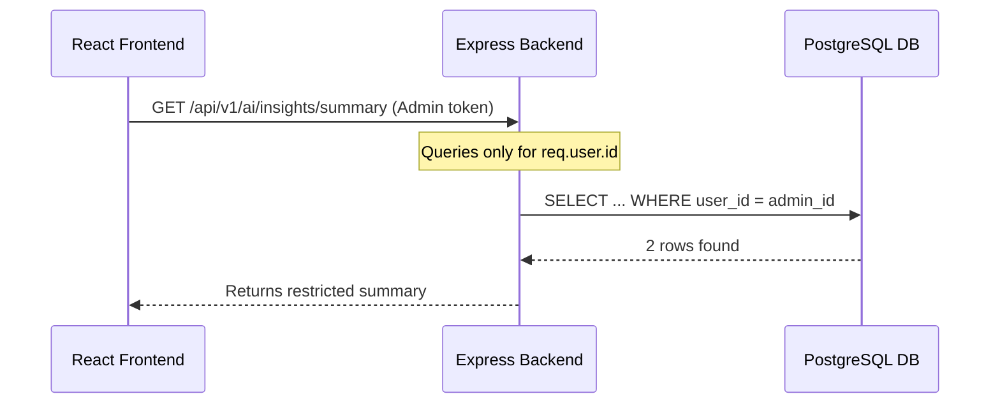
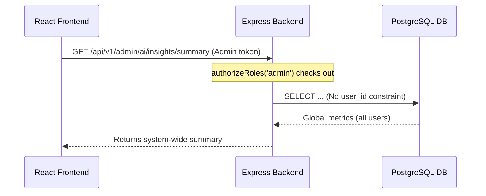

# Design Specification: Admin Medical Audit Logs Dashboard & Allergy Matching Optimization

**Date:** June 23, 2026  
**Authors:** Coding Agent  
**Status:** PROPOSED  

---

## 1. Executive Summary

This document specifies the design and architecture for two critical improvements in the MedAssist AI system:
1.  **Global Admin Medical Audit Logs Dashboard:** Resolves a logic limitation where the AI Insights admin page only shows logs for the admin's own API calls, expanding it to display global metrics across all users with advanced filters, timeline graphs, and a payload inspection modal.
2.  **Optimized Allergy Drug Resolution:** Replaces the inefficient linear $O(N)$ scan of the entire drug catalog in Node memory with a highly optimized two-stage fuzzy matching algorithm utilizing PostgreSQL Trigram indexing (`pg_trgm`) and candidate re-ranking.

---

## 2. Global Admin Medical Audit Logs Dashboard

### Current Limitation
The existing backend routes `/api/v1/ai/insights/summary` and `/api/v1/ai/insights/events` query the database using the requesting user's `userId`. For admin users viewing `/admin/ai-insights`, they only see their own test logs instead of a comprehensive view of system-wide LLM usage, fallback rates, and quality guard evaluations.



### Proposed Architecture (Global Dashboard)
We will introduce new dedicated admin endpoints under the admin path `/api/v1/admin/ai/insights/summary` and `/api/v1/admin/ai/insights/events` protected by `authorizeRoles('admin')`. These endpoints will execute global database queries.



### Technical Specs

#### Backend Changes

##### [New Repository Method] `AiAuditLogRepository.findAllRecent(options)`
Located in [AiAuditLogRepository.js](file:///Users/Shared/MedAssist-Project-AI-Drug-Recommendation-System/backend/src/repositories/AiAuditLogRepository.js).
```javascript
async findAllRecent(options = {}) {
  const days = Number.isFinite(options.days) ? Math.max(1, Math.round(options.days)) : 7;
  const limit = Number.isFinite(options.limit) ? Math.max(1, Math.min(100, Math.round(options.limit))) : 20;
  const values = [days];
  const conditions = ["created_at >= NOW() - ($1::int * INTERVAL '1 day')"];

  if (options.eventType) {
    values.push(options.eventType);
    conditions.push(`event_type = $${values.length}`);
  }
  if (options.status) {
    values.push(options.status);
    conditions.push(`status = $${values.length}`);
  }
  if (options.fallbackUsed !== undefined) {
    values.push(options.fallbackUsed === 'true' || options.fallbackUsed === true);
    conditions.push(`fallback_used = $${values.length}`);
  }

  values.push(limit);

  const { rows } = await this.#pool.query(
    `SELECT 
      l.id,
      l.user_id,
      u.email AS user_email,
      l.recommendation_id,
      l.event_type,
      l.provider,
      l.status,
      l.fallback_used,
      l.latency_ms,
      l.request_payload,
      l.response_payload,
      l.error_message,
      l.created_at
    FROM ai_audit_logs l
    LEFT JOIN users u ON l.user_id = u.id
    WHERE ${conditions.join(' AND ')}
    ORDER BY l.created_at DESC
    LIMIT $${values.length}`,
    values
  );
  return rows;
}
```

##### [New Service Methods] `AiAuditInsightsService.getGlobalSummary` & `getGlobalRecentEvents`
Exposes system-wide summary metrics and events, similarly translating raw rows to normalized data.

##### [New Express Routes] `/api/v1/admin/ai/insights/summary` & `/events`
Added to [adminRoutes.js](file:///Users/Shared/MedAssist-Project-AI-Drug-Recommendation-System/backend/src/routes/adminRoutes.js).
*   Authentication: `authenticate` middleware.
*   Authorization: `authorizeRoles('admin')` middleware.
*   Controllers: Map to `aiAuditInsightsController.getGlobalSummary` and `getGlobalRecentEvents`.

#### Frontend Changes
Update [AiInsights.jsx](file:///Users/Shared/MedAssist-Project-AI-Drug-Recommendation-System/frontend/src/pages/AiInsights.jsx) to support:
1.  **Global Toggle / Scoped Queries:** Request system metrics using the new `/api/v1/admin/ai/insights/` endpoints.
2.  **Filter Panel:** Add inputs for `eventType` (All, Explanation, Chatbot), `fallbackUsed` (All, Fallback, Direct), `status` (All, Success, Failure), and `days` (1, 7, 30 days).
3.  **Detailed Payload Viewer Modal:** Clicking an event displays a modal showing:
    *   **User Email & Time:** The user who generated the event.
    *   **Latency & Provider:** Performance parameters.
    *   **Request JSON (Formatted):** `symptoms`, `specialty`, `history`, `allergies`.
    *   **Response JSON (Formatted):** `answer`, `safety_note`, `quality`.

---

## 3. Allergy Matching Optimization (Dice Coefficient)

### Current Problem
In [AllergyService.js](file:///Users/Shared/MedAssist-Project-AI-Drug-Recommendation-System/backend/src/services/AllergyService.js#L125-L175), matching a text drug name (input by the user) to a record in the database fetches all drugs (`await this.#allergyRepository.getAllDrugs()`) and performs an in-memory loop calculation of Dice's Coefficient. For $N$ drugs in the database, this takes $O(N)$ CPU and memory.

### Proposed Two-Stage Hybrid Algorithm
We will optimize this matching using a hybrid approach:
1.  **Stage 1: Indexed Pre-filtering (PostgreSQL pg_trgm):** Use PostgreSQL trigram index to fast-query the top 10 most similar candidate drugs in $O(\log N)$ time.
2.  **Stage 2: Candidate Re-ranking (In-memory Dice):** Perform the Dice Coefficient calculation only on the 10 candidates returned by the database.

This preserves the current business rules (Dice scoring and exact match priority) while reducing the Node computational complexity from $O(N)$ to $O(10)$.

```
[User inputs drug name]
         │
         ▼
[PostgreSQL exact match query] ── (found) ──► Return drug.id (O(1))
         │
    (not found)
         ▼
[PostgreSQL pg_trgm query] ──► Retrieves Top 10 Candidate Drugs (O(log N))
         │
         ▼
[Compute Dice Coefficient on Top 10] ──► Select best match >= 0.4 (O(10))
```

### Technical Specs

#### Database Index Migration
Create a SQL migration file `docs/database/migrations/2026-06-23-enable-pg-trgm.sql`:
```sql
CREATE EXTENSION IF NOT EXISTS pg_trgm;

CREATE INDEX IF NOT EXISTS idx_drugs_name_trgm ON drugs USING gin (name gin_trgm_ops);
CREATE INDEX IF NOT EXISTS idx_drugs_generic_name_trgm ON drugs USING gin (generic_name gin_trgm_ops);
```

#### Repository Changes
In [AllergyRepository.js](file:///Users/Shared/MedAssist-Project-AI-Drug-Recommendation-System/backend/src/repositories/AllergyRepository.js), add `findFuzzyCandidates(query, limit = 10)`:
```javascript
async findFuzzyCandidates(query, limit = 10) {
  const cleanQuery = String(query || '').trim().toLowerCase();
  const { rows } = await this.#pool.query(
    `SELECT id, name, generic_name
     FROM drugs
     WHERE name % $1 OR generic_name % $1
     ORDER BY similarity(name, $1) DESC, similarity(generic_name, $1) DESC
     LIMIT $2`,
    [cleanQuery, limit]
  );
  return rows;
}
```

#### Service Changes
Modify `#resolveDrugId` in [AllergyService.js](file:///Users/Shared/MedAssist-Project-AI-Drug-Recommendation-System/backend/src/services/AllergyService.js):
```javascript
async #resolveDrugId(drugName) {
  if (!drugName || !drugName.trim()) {
    throw new AppError('Tên thuốc không được để trống', 400, 'DRUG_NAME_REQUIRED')
  }

  const cleanInput = drugName.trim().toLowerCase()

  // 1. First attempt: Quick exact match directly in DB
  const exactMatch = await this.#allergyRepository.findExactDrugMatch(cleanInput);
  if (exactMatch) {
    return exactMatch.id;
  }

  // 2. Fetch only the top 15 candidate matches using Trigram Index
  const candidates = await this.#allergyRepository.findFuzzyCandidates(cleanInput, 15);

  let bestMatch = null;
  let maxScore = 0;

  for (const drug of candidates) {
    const name = (drug.name || '').toLowerCase()
    const genericName = (drug.generic_name || '').toLowerCase()

    // Substring score calculation
    let substringScore = 0
    if (name.includes(cleanInput) || cleanInput.includes(name)) {
      substringScore = 0.8
    }
    if (genericName.includes(cleanInput) || cleanInput.includes(genericName)) {
      substringScore = Math.max(substringScore, 0.8)
    }

    // Dice similarity calculation
    const nameSimilarity = this.#getSimilarity(cleanInput, name)
    const genericSimilarity = this.#getSimilarity(cleanInput, genericName)
    const similarityScore = Math.max(nameSimilarity, genericSimilarity)

    const finalScore = Math.max(substringScore, similarityScore)
    if (finalScore > maxScore) {
      maxScore = finalScore
      bestMatch = drug
    }
  }

  if (bestMatch && maxScore >= 0.4) {
    return bestMatch.id
  }

  throw new AppError(
    `Không thể nhận dạng thuốc "${drugName}". Vui lòng chọn tên thuốc từ danh sách gợi ý.`,
    404,
    'DRUG_NOT_FOUND'
  )
}
```

---

## 4. Verification & Testing Plan

### Automated Tests
1.  **Allergy Matching Test:** Update [AllergyService.test.js](file:///Users/Shared/MedAssist-Project-AI-Drug-Recommendation-System/backend/test/AllergyService.test.js) (or add test cases) to verify:
    *   Exact matches resolve successfully.
    *   Fuzzy matches resolve correctly even with typos.
    *   Fails with 404 when similarity score is lower than 0.4.
2.  **Audit Insights Dashboard Route Test:** Add tests in `backend/test/` to check:
    *   GET `/api/v1/admin/ai/insights/summary` returns global counts for all users.
    *   Forbidden for non-admin accounts (returns 403).

### Manual Verification
1.  **Frontend Admin Check:** Log in with `admin.medassist@example.com` / `Admin@12345`, navigate to `/admin/ai-insights`, and confirm global logs of other user actions are aggregated correctly.
2.  **Inspect Modal View:** Open the events drawer and inspect request/response JSON payloads.
