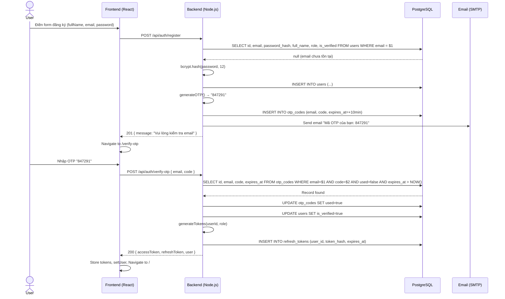
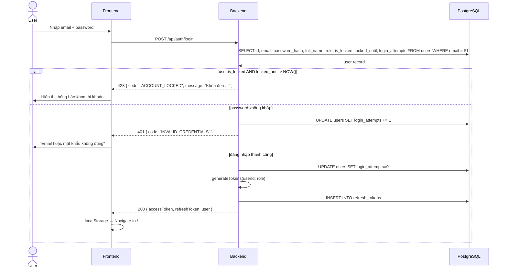
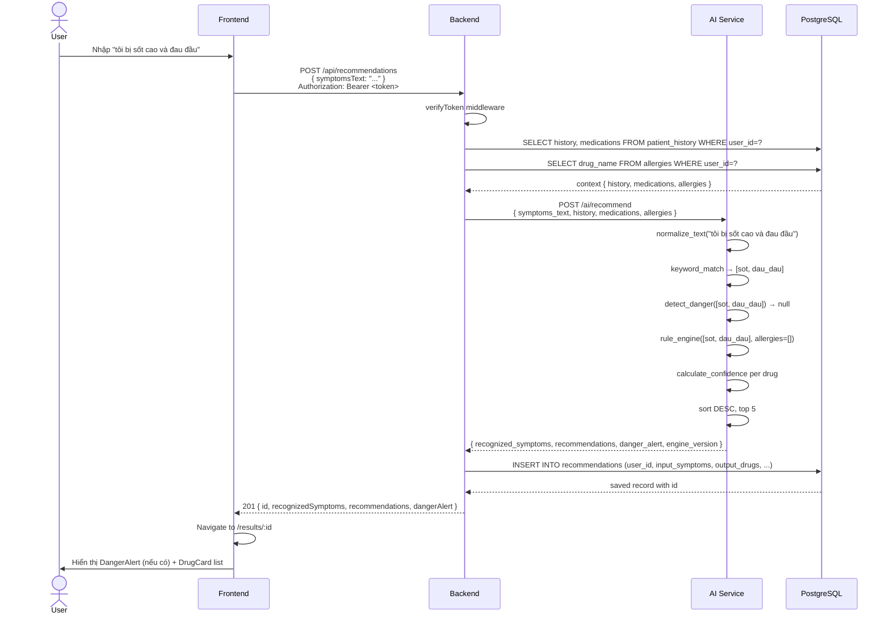
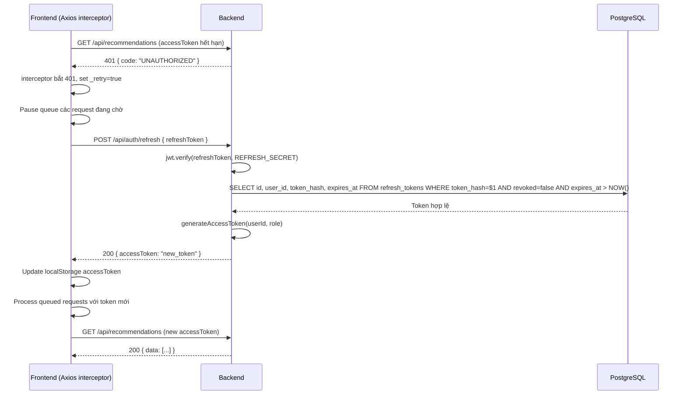

# Tài liệu Thiết kế Kỹ thuật (TDD)
# Technical Design Document — MedAssist AI

---

| Thông tin | Chi tiết |
|---|---|
| **Tên dự án** | MedAssist AI — Hệ thống Gợi ý Thuốc Thông minh |
| **Phiên bản TDD** | 1.0 |
| **Ngày tạo** | 21/05/2026 |
| **Nhóm thực hiện** | Nhóm 5 — Đề tài 95 |
| **Tài liệu tham chiếu** | SRS v1.0 · Sprint 2 Plan · ERD v1.0 · API Spec v1.0 |

---

## Mục lục

1. [Tổng quan kiến trúc hệ thống](#1-tổng-quan-kiến-trúc-hệ-thống)
2. [Thiết kế Backend Service](#2-thiết-kế-backend-service)
3. [Thiết kế AI Service](#3-thiết-kế-ai-service)
4. [Thiết kế Frontend](#4-thiết-kế-frontend)
5. [Luồng dữ liệu chính (Sequence Diagrams)](#5-luồng-dữ-liệu-chính)
6. [Thiết kế giải thuật](#6-thiết-kế-giải-thuật)
7. [Thiết kế bảo mật](#7-thiết-kế-bảo-mật)
8. [Chiến lược caching](#8-chiến-lược-caching)
9. [Xử lý lỗi](#9-xử-lý-lỗi)
10. [Thiết kế giao diện (UI/UX)](#10-thiết-kế-giao-diện-uiux)
11. [Yêu cầu phi chức năng](#11-yêu-cầu-phi-chức-năng)

---

## 1. Tổng quan kiến trúc hệ thống

### 1.1 Kiến trúc tổng thể

MedAssist AI được thiết kế theo mô hình **microservices 3 tầng** với tách biệt rõ ràng về trách nhiệm:

```
┌─────────────────────────────────────────────────────────────┐
│                    CLIENT LAYER                              │
│  ┌─────────────────────────────────────────────────────┐   │
│  │   Browser (Chrome/Firefox/Safari)                    │   │
│  │   React SPA — Vite build — TailwindCSS               │   │
│  └─────────────────────────────────────────────────────┘   │
│                    │ HTTPS                                   │
└────────────────────┼────────────────────────────────────────┘
                     │
┌────────────────────▼────────────────────────────────────────┐
│                  CDN / HOSTING LAYER                         │
│              Vercel (Static Assets + CDN)                    │
└────────────────────┬────────────────────────────────────────┘
                     │ REST API (HTTPS)
┌────────────────────▼────────────────────────────────────────┐
│                  APPLICATION LAYER                           │
│  ┌──────────────────────────────────────────────────────┐  │
│  │  Backend API — Node.js 20 + Express 4 (:5000)        │  │
│  │  Railway container — 512MB RAM                        │  │
│  │                                                        │  │
│  │  Route → Controller → Service → Repository            │  │
│  └────────────────────┬─────────────────────────────────┘  │
│                        │ HTTP internal                       │
│  ┌─────────────────────▼───────────────────────────────┐   │
│  │  AI Service — Python 3.11 + FastAPI (:8000)          │   │
│  │  Railway container — 1GB RAM                          │   │
│  │                                                        │   │
│  │  NLP Mapper → Rule Engine → Response Builder          │   │
│  └─────────────────────────────────────────────────────┘   │
└────────────────────┬────────────────────────────────────────┘
                     │ pg + redis
┌────────────────────▼────────────────────────────────────────┐
│                    DATA LAYER                                │
│  ┌──────────────────────┐  ┌───────────────────────────┐   │
│  │  PostgreSQL (Supabase)│  │  Redis (Railway)          │   │
│  │  9 tables · UUID PK  │  │  OTP TTL · Rate limit     │   │
│  └──────────────────────┘  └───────────────────────────┘   │
└─────────────────────────────────────────────────────────────┘
```

### 1.2 Nguyên tắc thiết kế cốt lõi

| Nguyên tắc | Áp dụng |
|---|---|
| **Separation of Concerns** | Mỗi service có trách nhiệm độc lập, không overlap |
| **Single Direction Data Flow** | FE → BE → AI (không bao giờ FE gọi AI trực tiếp) |
| **Dependency Injection** | Constructor injection toàn bộ Backend |
| **Fail Fast** | Validate input sớm nhất có thể, reject tại boundary |
| **Defense in Depth** | Bảo mật nhiều lớp: network, auth, input, DB |
| **Stateless API** | JWT stateless, Redis chỉ cache — không session server-side |

### 1.3 Quyết định kiến trúc quan trọng

**Q1: Tại sao không cho FE gọi AI Service trực tiếp?**
- AI Service không có auth layer riêng
- Backend cần enrich request với context user (history, allergies) từ DB trước khi gọi AI
- Tách biệt giúp thay thế AI engine mà không thay đổi FE

**Q2: Tại sao dùng JWT stateless thay vì session?**
- Phù hợp với deployment trên Railway (horizontal scaling)
- Không cần sticky session
- Refresh token revocation xử lý qua DB lookup

**Q3: Tại sao PostgreSQL thay vì MongoDB?**
- Dữ liệu có schema rõ ràng và quan hệ chặt chẽ (user→history, drug→symptoms)
- Cần ACID transactions cho auth flows
- Supabase free tier phù hợp ngân sách dự án

---

## 2. Thiết kế Backend Service

### 2.1 Kiến trúc 4 tầng (Layered Architecture)

```
HTTP Request
     │
     ▼
┌─────────────────────────────────────────────┐
│  ROUTE LAYER (routes/*.js)                  │
│  • Khai báo path + HTTP method              │
│  • Gắn middleware (auth, rateLimit)         │
│  • KHÔNG có logic                           │
└─────────────────────────┬───────────────────┘
                           │ req, res, next
                           ▼
┌─────────────────────────────────────────────┐
│  CONTROLLER LAYER (controllers/*.js)        │
│  • Nhận req, extract body/params/query      │
│  • Validate input (basic)                   │
│  • Gọi Service method                       │
│  • Format và trả response                   │
│  • KHÔNG đụng DB                           │
└─────────────────────────┬───────────────────┘
                           │ plain data objects
                           ▼
┌─────────────────────────────────────────────┐
│  SERVICE LAYER (services/*.js)              │
│  • Toàn bộ business logic                   │
│  • Orchestrate multiple repositories        │
│  • Throw AppError khi có lỗi business       │
│  • KHÔNG biết req/res tồn tại              │
│  • KHÔNG viết SQL                          │
└─────────────────────────┬───────────────────┘
                           │ SQL queries
                           ▼
┌─────────────────────────────────────────────┐
│  REPOSITORY LAYER (repositories/*.js)       │
│  • Chỉ query DB bằng SQL thuần (pg pool)    │
│  • KHÔNG có logic                           │
│  • Return plain JS objects                  │
└─────────────────────────────────────────────┘
```

### 2.2 Middleware Chain

```
Request
  │
  ├─ helmet()           → Security headers (XSS, CSP, HSTS)
  ├─ cors()             → Allow frontend origin
  ├─ express.json()     → Parse JSON body, limit 1MB
  ├─ rateLimiter()      → 100 req/min/IP (express-rate-limit + Redis)
  ├─ verifyToken()      → JWT validation (route-specific)
  ├─ requireAdmin()     → Role check (admin routes only)
  │
  ▼ Router Handler
  │
  └─ errorHandler()     → Global error catch, format AppError
```

### 2.3 Dependency Injection Pattern

```javascript
// Wiring tại entry point (app.js / route file)
const pool           = require('../config/db')
const redisClient    = require('../config/redis')
const userRepo       = new UserRepository(pool)
const authService    = new AuthService(userRepo, redisClient)
const authController = new AuthController(authService)

// ─── REPOSITORY — #pool private, nhận qua constructor ──────────────────────
class UserRepository {
  #pool                                    // [Encapsulation] không ai truy cập từ ngoài

  constructor(pool) {
    this.#pool = pool                      // [DI] nhận từ ngoài, không tự new
  }

  async findActiveByEmail(email) {
    const { rows } = await this.#pool.query(
      'SELECT id, email, password_hash, full_name, role FROM users WHERE email = $1 AND is_active = true',
      [email]                              // parameterized — không string concat
    )
    return rows[0] || null
  }
}

// ─── SERVICE — #userRepo và #redis private, nhận qua constructor ────────────
class AuthService {
  #userRepo                                // [Encapsulation]
  #redis                                   // [Encapsulation]

  constructor(userRepository, redisClient) {
    this.#userRepo = userRepository        // [DI]
    this.#redis    = redisClient           // [DI]
  }

  async login(email, password) {
    const user = await this.#userRepo.findActiveByEmail(email)
    if (!user) throw new AppError('Email không tồn tại', 401)
    const valid = await bcrypt.compare(password, user.password_hash)
    if (!valid) throw new AppError('Sai mật khẩu', 401)
    return this.#generateTokens(user)      // [Encapsulation] logic ẩn trong private method
  }

  #generateTokens(user) { /* ... */ }     // [Encapsulation] private
}

// ─── CONTROLLER — #authService private, nhận qua constructor ────────────────
class AuthController {
  #authService                             // [Encapsulation]

  constructor(authService) {
    this.#authService = authService        // [DI]
  }

  login = async (req, res, next) => {     // arrow function để giữ `this` context
    try {
      const result = await this.#authService.login(req.body.email, req.body.password)
      res.json(ApiResponse.success(result))
    } catch (err) {
      next(err)
    }
  }
}
```

**Lợi ích:** Encapsulation đảm bảo không ai truy cập internal state từ ngoài class; DI giúp dễ mock trong test, không có global state.

### 2.4 Error Response Standard

Mọi lỗi đều được format thống nhất qua `AppError` + `errorHandler`:

```
AppError(message, statusCode, code)
       │
       ▼
errorHandler middleware
       │
       ▼
{ success: false, message: "...", code: "ERROR_CODE" }
```

---

## 3. Thiết kế AI Service

### 3.1 NLP Pipeline

```
Input Text (tiếng Việt)
       │
       ▼
┌──────────────────────────────────────────┐
│  BƯỚC 1: TEXT NORMALIZATION             │
│  • Lowercase toàn bộ                    │
│  • Strip dấu câu thừa                   │
│  • Giữ nguyên dấu tiếng Việt            │
└──────────────────┬───────────────────────┘
                   │
                   ▼
┌──────────────────────────────────────────┐
│  BƯỚC 2: KEYWORD MATCHING               │
│  • Duyệt qua symptoms database          │
│  • Với mỗi symptom: check keywords[]    │
│  • Substring match (kw IN text_lower)   │
│  • Dedup bằng seen_codes set            │
└──────────────────┬───────────────────────┘
                   │
                   ▼
┌──────────────────────────────────────────┐
│  BƯỚC 3: DANGER DETECTION               │
│  • Check if any matched symptom         │
│    has is_danger = True                 │
│  • Generate danger_alert text           │
└──────────────────┬───────────────────────┘
                   │
                   ▼
┌──────────────────────────────────────────┐
│  BƯỚC 4: RULE ENGINE                    │
│  • Load drugs with symptom_weights      │
│  • Apply allergy filter                 │
│  • Calculate confidence per drug        │
│  • Sort DESC, take top 5               │
└──────────────────┬───────────────────────┘
                   │
                   ▼
┌──────────────────────────────────────────┐
│  BƯỚC 5: RESPONSE BUILDER               │
│  • Generate reason text per drug        │
│  • Attach warnings & contraindications  │
│  • Return RecommendResponse             │
└──────────────────────────────────────────┘
```

### 3.2 Confidence Score Algorithm

**Công thức:**

```
               Σ (weight_i × match_i)
confidence = ─────────────────────────
                  Σ (weight_i)

Trong đó:
  weight_i  = trọng số của triệu chứng i với thuốc đang xét (từ drug_symptoms.weight)
  match_i   = 1 nếu triệu chứng i có trong input, 0 nếu không
  Σ weight_i = tổng tất cả trọng số của thuốc đó (mẫu số cố định)
```

**Ví dụ tính toán:**

Input: người dùng nhập "sốt và đau đầu" → NLP nhận diện: `{sot, dau_dau}`

Thuốc **Paracetamol 500mg** có symptom_weights:
```
sot      → weight = 0.95  (is_primary = true)
dau_dau  → weight = 0.80  (is_primary = true)
met_moi  → weight = 0.40  (is_primary = false)
```

Tính confidence:
```
Tử số   = (0.95 × 1) + (0.80 × 1) + (0.40 × 0) = 1.75
Mẫu số  = 0.95 + 0.80 + 0.40 = 2.15
Confidence = 1.75 / 2.15 = 0.814 ≈ 81%
```

Thuốc **Amoxicillin 500mg** có symptom_weights:
```
ho       → weight = 0.70
dau_hong → weight = 0.85
sot      → weight = 0.65
```

Tính confidence (chỉ `sot` khớp):
```
Tử số   = (0.70 × 0) + (0.85 × 0) + (0.65 × 1) = 0.65
Mẫu số  = 0.70 + 0.85 + 0.65 = 2.20
Confidence = 0.65 / 2.20 = 0.295 ≈ 30%
```

→ Paracetamol xếp trên Amoxicillin trong kết quả.

### 3.3 Allergy Filter Algorithm

```python
def is_allergic(drug, user_allergies):
    """
    Kiểm tra thuốc có trong danh sách dị ứng không.
    So sánh case-insensitive với tên thuốc VÀ hoạt chất.
    """
    allergies_lower = [a.lower() for a in user_allergies]
    drug_name_lower = drug["name_vi"].lower()
    ingredient_lower = drug["active_ingredient"].lower()

    for allergy in allergies_lower:
        if allergy in drug_name_lower or allergy in ingredient_lower:
            return True
    return False
```

### 3.4 Danger Detection

```python
DANGER_SYMPTOM_CODES = {
    "kho_tho", "dau_nguyen", "sot_cao", "biet_liet"
}

DANGER_MESSAGES = {
    "kho_tho":   "Khó thở có thể là dấu hiệu bệnh phổi hoặc tim mạch. Đến cơ sở y tế ngay.",
    "dau_nguyen":"Đau ngực có thể là triệu chứng nhồi máu cơ tim. Gọi 115 ngay!",
    "sot_cao":   "Sốt cao kéo dài có thể là nhiễm trùng nặng. Cần thăm khám ngay.",
    "biet_liet": "Tê liệt đột ngột là dấu hiệu đột quỵ. Gọi 115 ngay!",
}

def detect_danger(symptom_codes: list[str]) -> str | None:
    for code in symptom_codes:
        if code in DANGER_SYMPTOM_CODES:
            return (
                "⚠️ Cảnh báo y tế: "
                + DANGER_MESSAGES[code]
                + " Thông tin gợi ý dưới đây chỉ mang tính tham khảo."
            )
    return None
```

---

## 4. Thiết kế Frontend

### 4.1 Cây component

```
App
├── AuthProvider (Context)
│   └── BrowserRouter
│       ├── /login          → LoginPage
│       ├── /register       → RegisterPage
│       ├── /verify-otp     → OTPVerifyPage
│       └── ProtectedRoute
│           ├── /           → DashboardPage
│           ├── /symptoms   → SymptomInputPage
│           ├── /results/:id → ResultsPage
│           ├── /profile    → ProfilePage
│           │   ├── HistorySection
│           │   └── AllergySection
│           └── /admin      → AdminPage (role=admin)
│               ├── DrugManagerPanel
│               └── SymptomManagerPanel
│
├── common/
│   ├── Navbar
│   ├── Button
│   ├── Card
│   ├── Input
│   ├── Modal
│   ├── LoadingSpinner
│   └── EmptyState
│
└── symptoms/
    ├── SymptomSelector     ← text input + recognized tags
    ├── SeverityPicker      ← Nhẹ/Vừa/Nặng per symptom
    ├── DrugCard            ← confidence bar + reason + warnings
    └── DangerAlert         ← red banner
```

### 4.2 State Management

```
AuthContext (Global)
├── user: { id, fullName, email, role } | null
├── isAuthenticated: boolean
├── login(email, password) → Promise
└── logout() → void

Local State (per page, useState):
├── SymptomInputPage: { text, loading, error }
├── ResultsPage:      { result, showFiltered }
├── ProfilePage:      { history[], allergies[], loading }
└── LoginPage:        { form, error, loading }
```

### 4.3 API Service Layer

```javascript
// services/api.js — Axios instance với interceptors

// REQUEST interceptor: tự động gắn Bearer token
api.interceptors.request.use(config => {
  const token = localStorage.getItem('accessToken')
  if (token) config.headers.Authorization = `Bearer ${token}`
  return config
})

// RESPONSE interceptor: tự động refresh khi 401
api.interceptors.response.use(
  res => res,
  async err => {
    if (err.response?.status === 401 && !originalRequest._retry) {
      // Refresh token flow
      // Queue các request đang chờ
      // Retry original request với token mới
    }
  }
)
```

### 4.4 Navigation Flow

```
/login ──── (login success) ────→ /
  │
  └── (no account) ──→ /register ──── (submit) ──→ /verify-otp
                                                         │
                                           (OTP valid) ──→ /
                                                         │
/ (Dashboard) ──── (click Tra cứu) ──→ /symptoms
                                            │
                                 (submit text) ──→ /results/:id
                                            │
                                 (view history) ──→ /profile

/ ─── (admin role) ──→ /admin
```

---

## 5. Luồng dữ liệu chính

### 5.1 Luồng Đăng ký + Xác thực OTP



### 5.2 Luồng Đăng nhập (Email/Password)



### 5.3 Luồng Gợi ý thuốc (End-to-End)



### 5.4 Luồng Refresh Token



---

## 6. Thiết kế giải thuật

### 6.1 NLP Symptom Mapper — Pseudocode

```
FUNCTION map_text_to_symptoms(text: string) → List[Symptom]:
    INPUT:  raw text từ người dùng
    OUTPUT: danh sách symptoms đã nhận diện

    symptoms_db   ← load_all_symptoms_from_json()
    text_lower    ← text.lower().strip()
    matched       ← []
    seen_codes    ← Set()

    FOR EACH symptom IN symptoms_db:
        FOR EACH keyword IN symptom.keywords:
            IF keyword.lower() IN text_lower:
                IF symptom.code NOT IN seen_codes:
                    matched.append(symptom)
                    seen_codes.add(symptom.code)
                BREAK  // thoát vòng keyword, sang symptom tiếp theo

    RETURN matched

COMPLEXITY: O(S × K) với S = số symptoms, K = số keywords trung bình
           S ≈ 50, K ≈ 5  →  O(250) mỗi query — rất nhanh
```

### 6.2 Rule Engine — Pseudocode

```
FUNCTION recommend(symptom_codes: List[str], allergies: List[str]) → dict:
    INPUT:  danh sách symptom codes đã nhận diện, danh sách dị ứng user
    OUTPUT: { recommendations: List[Drug], danger_alert: str|null }

    drugs_db       ← load_all_drugs_from_json()
    allergies_lower ← [a.lower() for a in allergies]
    results        ← []

    FOR EACH drug IN drugs_db:
        // BƯỚC 1: Lọc dị ứng
        IF is_allergic(drug, allergies_lower):
            CONTINUE

        weights    ← drug.symptom_weights  // {symptom_code: weight}
        IF weights is empty:
            CONTINUE

        // BƯỚC 2: Tính confidence
        total_weight   ← SUM(weights.values())
        matched_weight ← SUM(weights[s] FOR s IN symptom_codes IF s IN weights)

        IF matched_weight == 0:
            CONTINUE  // không có triệu chứng nào khớp

        confidence ← ROUND(matched_weight / total_weight, 2)

        // BƯỚC 3: Tạo reason text
        matched_names ← [s FOR s IN symptom_codes IF s IN weights]
        reason ← "Khớp với triệu chứng: " + JOIN(matched_names, ", ")
        IF allergies: reason += " | Không có trong danh sách dị ứng"

        results.append({
            drug_code, drug_name, active_ingredient,
            confidence, reason, warnings, contraindications
        })

    // BƯỚC 4: Sắp xếp và lấy top 5
    results.sort(key=confidence, reverse=True)

    // BƯỚC 5: Kiểm tra danger
    danger_alert ← detect_danger(symptom_codes)

    RETURN { recommendations: results[:5], danger_alert }

COMPLEXITY: O(D × S) với D = số drugs, S = số symptoms được match
```

### 6.3 JWT Token Lifecycle

```
ĐĂNG NHẬP THÀNH CÔNG
        │
        ▼
Generate access_token  (JWT, exp: +15 phút)
Generate refresh_token (JWT, exp: +7 ngày)
        │
        ├── access_token  → trả về trong response body
        └── refresh_token → trả về trong response body
                            (lưu trong localStorage của FE - Sprint 2)
                            (TODO Sprint 4: chuyển sang HttpOnly cookie)

API CALL với access_token:
  valid   → xử lý bình thường
  expired → 401 → FE interceptor gọi /api/auth/refresh

REFRESH FLOW:
  valid refresh_token → cấp access_token mới
  invalid/revoked     → 401 → FE redirect /login

LOGOUT:
  revoke refresh_token trong DB (set revoked=true)
  FE xóa tokens khỏi localStorage
```

---

## 7. Thiết kế bảo mật

### 7.1 Threat Model

| Mối đe dọa | Biện pháp |
|---|---|
| Brute force đăng nhập | Khóa tài khoản 15 phút sau 5 lần sai, rate limit 10 req/min cho /auth |
| Token theft (XSS) | HttpOnly cookie (Sprint 4), short-lived access token (15 phút) |
| SQL Injection | Parameterized queries với pg pool ($1, $2...) |
| CSRF | JWT trong header (không cookie, Sprint 2) |
| Unauthorized AI access | AI Service không expose public endpoint, chỉ Railway internal network |
| Password breach | bcrypt cost 12 (≈ 250ms per hash) |
| Token replay after logout | Refresh token revocation trong DB |
| Mass registration spam | Rate limit 5 req/10min cho /register per IP |

### 7.2 Input Validation

```javascript
// Các rule validate tại Controller layer:
register:    fullName required, email valid format, password >= 8 chars + uppercase + number
login:       email + password required
symptoms:    symptomsText: 3-500 chars, string
history:     entryType IN ['chronic_disease','current_medication','diagnosis']
             title: 1-200 chars
allergy:     drugName: 1-200 chars, no SQL special chars
```

### 7.3 Security Headers (Helmet.js)

```
X-Content-Type-Options: nosniff
X-Frame-Options: DENY
X-XSS-Protection: 1; mode=block
Strict-Transport-Security: max-age=31536000; includeSubDomains
Content-Security-Policy: default-src 'self'
```

---

## 8. Chiến lược caching

### 8.1 Redis Usage Map

| Key pattern | TTL | Mục đích |
|---|---|---|
| `rate:auth:{ip}` | 60s | Count auth requests per IP (express-rate-limit) |
| `rate:api:{ip}` | 60s | Count general API requests per IP |
| `otp:attempts:{email}` | 600s | Count OTP retry attempts (max 3) |
| `drug:{id}` | 3600s | Cache drug record theo ID (1 giờ) |
| `recommend:{symptoms_key}` | 1800s | Cache kết quả recommend theo tập triệu chứng (30 phút) |
| `refresh:{userId}` | 604800s | Hash của refresh token (7 ngày) |

```javascript
// Cache drug query
await redis.setEx(`drug:${id}`, 3600, JSON.stringify(drug))

// Cache recommendation — key dùng symptoms đã sort để đảm bảo cache hit
const cacheKey = `recommend:${symptoms.sort().join('-')}`
await redis.setEx(cacheKey, 1800, JSON.stringify(result))

// Lưu refresh token hash (không lưu plain token)
await redis.setEx(`refresh:${userId}`, 604800, tokenHash)
```

> **Lưu ý:** Recommendation cache dùng symptoms làm key — không include user context.
> Context user (history, allergies) đã được Backend enrich trước khi gọi AI,
> nên kết quả AI với cùng tập triệu chứng là giống nhau và có thể cache được.

### 8.2 Cache Invalidation

- OTP: tự hết hạn theo TTL (10 phút)
- Rate limit counter: tự reset mỗi phút
- Drug cache: tự hết hạn sau 1 giờ; bust thủ công khi admin cập nhật drug record
- Recommendation cache: tự hết hạn sau 30 phút
- Refresh token: tự hết hạn sau 7 ngày; xóa thủ công khi user logout (`redis.del`)

### 8.3 DB Connection Pooling

```javascript
// PostgreSQL pool config
const pool = new Pool({
  connectionString: DATABASE_URL,
  max: 10,              // tối đa 10 connections
  idleTimeoutMillis: 30000,
  connectionTimeoutMillis: 2000,
})
```

---

## 9. Xử lý lỗi

### 9.1 Error Hierarchy

```
Error (JS built-in)
  └── AppError
        ├── message:     string  (hiển thị cho user)
        ├── statusCode:  number  (HTTP status)
        ├── code:        string  (machine-readable code)
        └── isOperational: true (biết đây là lỗi có chủ ý)
```

### 9.2 HTTP Status Code Mapping

| Code | HTTP | Tình huống |
|---|---|---|
| `VALIDATION_ERROR` | 400 | Input không hợp lệ |
| `UNAUTHORIZED` | 401 | Token không hợp lệ / hết hạn |
| `FORBIDDEN` | 403 | Không đủ quyền (role) |
| `NOT_FOUND` | 404 | Resource không tồn tại |
| `EMAIL_EXISTS` | 409 | Email đã được đăng ký |
| `OTP_INVALID` | 400 | OTP sai hoặc hết hạn |
| `ACCOUNT_LOCKED` | 423 | Tài khoản bị khóa |
| `AI_UNAVAILABLE` | 503 | AI service không phản hồi |
| `INTERNAL_ERROR` | 500 | Lỗi không xác định |

### 9.3 Frontend Error Handling

```javascript
// Mọi API call trong page component đều wrap try/catch:
try {
  const { data } = await api.post('/api/recommendations', { symptomsText })
  // handle success
} catch (err) {
  // err.response.data.message là message từ BE
  setError(err.response?.data?.message || 'Lỗi không xác định. Thử lại sau.')
} finally {
  setLoading(false)
}
```

---

## 10. Thiết kế giao diện (UI/UX)

### 10.1 Danh sách màn hình

| Màn hình | Route | Mô tả |
|---|---|---|
| Login | `/login` | Đăng nhập email/password + Google OAuth |
| Register | `/register` | Tạo tài khoản mới |
| OTP Verify | `/verify-otp` | Nhập mã 6 số từ email |
| Dashboard | `/` | Trang chủ sau đăng nhập |
| Symptom Input | `/symptoms` | Nhập triệu chứng text tự do |
| Results | `/results/:id` | Hiển thị kết quả gợi ý thuốc |
| Profile | `/profile` | Quản lý tiền sử bệnh + dị ứng |
| History | `/history` | Lịch sử tra cứu 30 ngày |
| Admin | `/admin` | Quản lý thuốc + triệu chứng (admin only) |

### 10.2 Navigation Flow

```
         ┌──────────┐
    ┌────│  /login  │────┐
    │    └──────────┘    │ (success)
    │         │          │
    │    (no account)    ▼
    │         │     ┌─────────┐
    │         │     │    /    │◄──────────────────┐
    │         │     │Dashboard│                   │
    │         │     └────┬────┘                   │
    │         │          │ (click Tra cứu)         │
    │    ┌────▼──────┐   │                         │
    │    │/register  │   ▼                         │
    │    └────┬──────┘ ┌──────────┐               │
    │         │        │/symptoms │               │
    │    (submit)      └────┬─────┘               │
    │         │        (submit)                   │
    │    ┌────▼──────┐      │                     │
    │    │/verify-otp│   ┌──▼──────────┐          │
    │    └────┬──────┘   │/results/:id │          │
    │         │ (valid)  └─────────────┘          │
    └─────────┘                                   │
         └──────────────────────────────────────── ┘
```

### 10.3 Wireframe Descriptions

#### Trang Login (`/login`)
```
┌────────────────────────────────────┐
│          🏥 MedAssist AI           │
│     "Gợi ý thuốc thông minh"      │
│                                    │
│  [Email input field              ] │
│  [Password input field           ] │
│                                    │
│  [ Đăng nhập ] (blue button)      │
│                                    │
│  ─────────── hoặc ──────────       │
│  [ 🔵 Đăng nhập với Google ]      │
│                                    │
│  Chưa có tài khoản? [Đăng ký]     │
└────────────────────────────────────┘
```

#### Trang Nhập triệu chứng (`/symptoms`)
```
┌────────────────────────────────────┐
│  🏥 MedAssist AI      [Logout]    │
├────────────────────────────────────┤
│                                    │
│  Mô tả triệu chứng của bạn        │
│  "Viết tự nhiên bằng tiếng Việt"  │
│                                    │
│ ┌──────────────────────────────┐  │
│ │ Tôi bị sốt cao và đau đầu   │  │
│ │                              │  │
│ │                              │  │
│ └──────────────────────────────┘  │
│  0/500 ký tự                       │
│                                    │
│  [ 🔍 Tìm thuốc phù hợp ] (blue) │
│                                    │
│  ⚕️ Chỉ mang tính tham khảo       │
└────────────────────────────────────┘
```

#### Trang Kết quả (`/results/:id`)
```
┌────────────────────────────────────┐
│  🏥 MedAssist AI    [← Tra cứu]  │
├────────────────────────────────────┤
│ ⚠️ [DANGER ALERT - red banner]   │  ← chỉ hiện khi có
├────────────────────────────────────┤
│ Triệu chứng nhận diện:             │
│ [Sốt 🔵] [Đau đầu 🔵]           │
├────────────────────────────────────┤
│ Gợi ý thuốc (3 kết quả)           │
│                                    │
│ ┌──────────────────────────────┐  │
│ │ Paracetamol 500mg            │  │
│ │ Acetaminophen                │  │
│ │ Độ phù hợp: ████████░░ 81%  │  │
│ │ 💡 Lý do: khớp sốt, đau đầu│  │
│ │ ⚠️ Không dùng quá 8v/ngày   │  │
│ └──────────────────────────────┘  │
│                                    │
│ ┌──────────────────────────────┐  │
│ │ Ibuprofen 400mg              │  │
│ │ ...                          │  │
│ └──────────────────────────────┘  │
│                                    │
│  [ 📄 Export PDF ]                │
│                                    │
│ ─────────────────────────────────  │
│ ⚕️ Disclaimer text                │
└────────────────────────────────────┘
```

### 10.4 Design System

| Token | Giá trị | Dùng cho |
|---|---|---|
| `primary` | `#2563EB` (blue-600) | Buttons, links, highlights |
| `danger` | `#DC2626` (red-600) | Allergy badge, danger alert |
| `success` | `#16A34A` (green-600) | High confidence indicator |
| `warning` | `#D97706` (amber-600) | Medium confidence |
| Font | Inter / system-ui | Toàn bộ UI |
| Radius | `rounded-xl` (12px) | Cards, buttons |
| Shadow | `shadow-sm` | Cards |

---

## 11. Yêu cầu phi chức năng

### 11.1 Hiệu năng

| Chỉ số | Yêu cầu | Đo lường |
|---|---|---|
| API response time | < 1 giây (p95) | Từ BE nhận request đến trả response |
| AI inference time | < 500ms | Từ AI nhận request đến trả kết quả |
| Page load (FCP) | < 2 giây | First Contentful Paint trên 4G |
| Concurrent users | 50 | Staging environment |
| DB query time | < 100ms | p99 simple queries |

### 11.2 Bảo mật

| Yêu cầu | Mức độ |
|---|---|
| HTTPS enforced | Bắt buộc (production) |
| Password hashing | bcrypt cost 12 |
| JWT expiry | Access: 15 phút · Refresh: 7 ngày |
| Rate limiting | 100 req/min general · 10 req/min auth |
| SQL injection protection | Parameterized queries |
| Input length limits | Mọi input có maxLength |

### 11.3 Khả năng bảo trì

| Yêu cầu | Giá trị |
|---|---|
| Test coverage (Backend) | ≥ 80% |
| Test coverage (AI Service) | ≥ 70% |
| Log level (production) | ERROR + WARN |
| Log level (development) | DEBUG |
| API versioning | Implicit v1 (prefix /api) |
| Code style | ESLint (BE) · Ruff (AI) · Prettier (FE) |

### 11.4 Khả năng mở rộng (Scalability)

Trong phiên bản MVP, hệ thống thiết kế cho 50 concurrent users. Kiến trúc đã chuẩn bị cho việc scale:
- **Backend**: Stateless → dễ horizontal scale trên Railway
- **AI Service**: Stateless → có thể chạy nhiều replica
- **DB**: Connection pool + index → handle tăng tải
- **Cache**: Redis layer sẵn sàng → thêm caching khi cần

---

*Tài liệu TDD v1.0 — MedAssist AI — 21/05/2026*
*Được tạo tự động từ SRS v1.0 và Sprint 2 Implementation Plan*
*Reviewer: HA (Leader) · Nguyên (AI) · Khoa (FE)*
